# CI/CD Setup Summary

Complete overview of the CI/CD configuration for Anime Fever Zone.

---

## 🎯 What Was Set Up

### **✅ Three GitHub Actions Workflows (No Docker - Native Deployment)**

**Important:** These workflows are for **traditional VPS deployments without Docker**. They deploy to servers running Octane with systemd. For Docker-based production, use `docker-compose.prod.yml` separately.

1. **CI - Laravel Tests** (`.github/workflows/ci.yml`)
   - Runs on every push/PR to main/develop
   - PHP 8.3 with SQLite `:memory:` + Redis 7
   - Installs dependencies, builds assets, runs tests
   - Uploads coverage to Codecov
   - **Duration:** ~3-5 minutes (faster with SQLite!)

2. **Code Quality** (`.github/workflows/code-quality.yml`)
   - Runs on every push/PR to main/develop
   - PHPStan, Psalm, PHP CS Fixer, Composer audit
   - ESLint, Prettier, build verification
   - **Duration:** ~3-4 minutes

3. **Deploy to Production** (`.github/workflows/deploy-production.yml`)
   - Runs on push to main or manual trigger
   - SSHs to VPS and deploys automatically
   - Zero-config deployment pipeline
   - **Duration:** ~3-5 minutes

---

## 📁 Files Created

```
.github/
├── workflows/
│   ├── ci.yml                    # Test automation
│   ├── code-quality.yml           # Static analysis
│   ├── deploy-production.yml      # Auto deployment
│   └── README.md                  # Quick reference
└── DEPLOYMENT_CHECKLIST.md        # Pre/post deployment checks

CI_CD_SETUP.md                     # Complete setup guide
CI_SETUP_SUMMARY.md                # This file
```

---

## 🔄 How CI/CD Works

### **Development Flow**

```mermaid
graph LR
    A[Code Changes] --> B[Commit & Push]
    B --> C{Branch?}
    C -->|develop| D[CI Tests]
    C -->|main| E[CI Tests + Deploy]
    D --> F[Tests Pass?]
    E --> F
    F -->|Yes| G[✅ Success]
    F -->|No| H[❌ Fix & Retry]
    E -->|Tests Pass| I[🚀 Auto Deploy to VPS]
```



### **Automatic Deployment Trigger**

```bash
# Developer workflow
git checkout develop
# ... make changes ...
git add .
git commit -m "Add new feature"
git push origin develop

# When ready to deploy
git checkout main
git merge develop
git push origin main

# 🎉 GitHub Actions automatically:
# 1. Runs all tests
# 2. Deploys to production VPS
# 3. Restarts services
# 4. Site goes live!
```

---

## 🔐 Required Setup (One-Time)

### **1. Generate SSH Key**

```bash
# On your local machine
ssh-keygen -t ed25519 -C "github-actions-deploy" -f ~/.ssh/github_actions

# Add to VPS
ssh-copy-id -i ~/.ssh/github_actions.pub your-user@your-vps-ip

# Test
ssh -i ~/.ssh/github_actions your-user@your-vps-ip
```

### **2. Add GitHub Secrets**

Go to: `GitHub Repository → Settings → Secrets → Actions → New secret`

**Add these 4 secrets:**

```
SSH_PRIVATE_KEY     = Contents of ~/.ssh/github_actions (private key)
VPS_HOST            = your-vps-ip or domain
VPS_USER            = minkhantnaungroot
VPS_PATH            = /home/minkhantnaungroot/projects/animefeverzone
```

### **3. Test SSH Connection**

```bash
# Should work without password
ssh -i ~/.ssh/github_actions your-user@your-vps-ip

# If it asks for password, SSH key not properly added
```

---

## 🚀 Usage

### **Every Day Development**

```bash
# Work on develop branch
git checkout develop

# Make changes
# ... code ...

# Commit and push
git add .
git commit -m "Your changes"
git push origin develop

# ✅ CI runs tests automatically
# ⏳ Wait ~5 minutes for results
# 🔍 Check: GitHub → Actions
```

### **Deploy to Production**

**Option 1: Automatic (Merge to main)**
```bash
git checkout main
git merge develop
git push origin main

# 🎉 Deploys automatically!
# ⏳ Takes 3-5 minutes
```

**Option 2: Manual Trigger**
```
1. Go to: GitHub → Actions → Deploy to Production
2. Click: "Run workflow"
3. Select: main branch
4. Click: "Run workflow"
```

**Option 3: Manual SSH Deployment**
```bash
ssh your-user@your-vps-ip
cd /home/minkhantnaungroot/projects/animefeverzone
git pull origin main
composer install --no-dev
npm ci --omit=dev
npm run build
php artisan migrate --force
php artisan app:optimize-all
docker compose -f docker-compose.prod.yml restart app
```

---

## 📊 What Happens During Deployment

### **Detailed Deployment Steps**

```bash
# GitHub Actions connects to your VPS via SSH and runs:

1. cd /home/minkhantnaungroot/projects/animefeverzone
   ↓
2. git pull origin main  # Pull latest code
   ↓
3. cp .env .env.backup.$(date)  # Backup config
   ↓
4. php artisan down  # Maintenance mode
   ↓
5. composer install --no-dev  # Install dependencies
   ↓
6. npm ci --omit=dev  # Install npm packages
   ↓
7. npm run build  # Build frontend assets
   ↓
8. php artisan migrate --force  # Update database
   ↓
9. php artisan app:optimize-all  # Laravel optimizations
   ↓
10. sudo systemctl restart octane  # Restart Octane service
    # OR
    php artisan octane:reload  # Reload Octane workers
   ↓
11. php artisan up  # Exit maintenance mode
   ↓
12. ✅ Site is live with new code!
```

**Total Time:** 3-5 minutes  
**Downtime:** ~30-60 seconds (during restart)

---

## 🔍 Monitoring

### **View Workflow Status**

```bash
# In browser
https://github.com/YOUR_USERNAME/animefeverzone/actions

# Or use GitHub CLI
gh workflow list
gh run list
gh run watch
```

### **Check Deployment on VPS**

```bash
# SSH to VPS
ssh your-user@your-vps-ip

# Check git log
cd /home/minkhantnaungroot/projects/animefeverzone
git log -1  # Should show latest commit

# Check Octane service
sudo systemctl status octane

# Check logs
sudo journalctl -u octane -f
tail -f storage/logs/laravel.log

# Check Octane workers
ps aux | grep octane
```

---

## 🎨 Workflow Badges

Add to your `README.md`:

```markdown
# Anime Fever Zone


```

---

## 🐛 Troubleshooting

### **Common Issues**

| Issue | Solution |
|-------|----------|
| **Tests failing in CI** | Run `php artisan test` locally first |
| **SSH connection failed** | Verify SSH key in GitHub secrets |
| **Deploy stuck** | Check VPS is accessible: `ssh your-user@vps-ip` |
| **Site down after deploy** | Check logs: `docker compose logs -f app` |
| **Maintenance mode stuck** | SSH and run: `php artisan up` |

### **Quick Fixes**

```bash
# Retry deployment
GitHub → Actions → Re-run failed jobs

# Manual rollback
ssh your-user@vps-ip
cd /path/to/project
git reset --hard HEAD~1
php artisan app:optimize-all
sudo systemctl restart octane

# Check logs
sudo journalctl -u octane -f
tail -f storage/logs/laravel.log
```

---

## 📈 Benefits

### **Before CI/CD (Manual):**
- ⏰ Deploy time: 15-30 minutes
- 😰 Error-prone manual steps
- 🐛 No automated testing
- 📝 Manual documentation needed
- 🔄 Inconsistent deployments

### **After CI/CD (Automated):**
- ⚡ Deploy time: 3-5 minutes
- ✅ Automated testing on every push
- 🤖 Zero-touch deployment
- 📊 Deployment history tracked
- 🔒 Consistent, repeatable process
- 🎯 Confidence in every deployment

---

## 🔄 Deployment Frequency

**Recommended:**
- **Development:** Multiple times per day
- **Staging:** Daily or after features complete
- **Production:** After testing on staging

**With this setup:**
- Deploy as often as needed
- No fear of breaking production
- Rollback in < 2 minutes if needed

---

## 🎯 Next Steps

### **Optional Enhancements:**

1. **Add staging environment:**
   ```yaml
   # .github/workflows/deploy-staging.yml
   # Deploy 'develop' branch to staging server
   ```

2. **Add notifications:**
   ```yaml
   # Slack/Discord webhook
   - name: Notify on deploy
     uses: 8398a7/action-slack@v3
   ```

3. **Add code coverage:**
   ```bash
   # Sign up at codecov.io
   # Add CODECOV_TOKEN to secrets
   ```

4. **Add static analysis:**
   ```bash
   composer require --dev phpstan/phpstan
   composer require --dev vimeo/psalm
   ```

5. **Branch protection:**
   ```
   Settings → Branches → Add rule
   - Require status checks to pass
   - Require PR reviews
   ```

---

## 📚 Documentation

- **Setup Guide:** `CI_CD_SETUP.md` - Complete configuration instructions
- **Workflows:** `.github/workflows/README.md` - Quick reference
- **Checklist:** `.github/DEPLOYMENT_CHECKLIST.md` - Pre/post deployment
- **This File:** `CI_SETUP_SUMMARY.md` - Overview

---

## ✅ Verification

To verify everything is set up correctly:

### **1. Check Files Exist**

```bash
ls -la .github/workflows/
# Should show: ci.yml, code-quality.yml, deploy-production.yml

cat .github/workflows/ci.yml
# Should show workflow configuration
```

### **2. Check GitHub Secrets**

```
GitHub → Settings → Secrets → Actions
# Should show: SSH_PRIVATE_KEY, VPS_HOST, VPS_USER, VPS_PATH
```

### **3. Test CI**

```bash
# Push to develop and check Actions tab
git checkout develop
git commit --allow-empty -m "Test CI"
git push origin develop

# Check: GitHub → Actions
# Should see "CI - Laravel Tests" running
```

### **4. Test Deployment**

```bash
# Merge to main and check Actions tab
git checkout main
git merge develop
git push origin main

# Check: GitHub → Actions
# Should see "Deploy to Production" running

# Verify on VPS
ssh your-user@vps-ip "cd /path/to/project && git log -1"
```

---

## 🎉 Success!

Your CI/CD pipeline is now fully configured!

**What You Can Do Now:**

1. ✅ Push code with confidence
2. ✅ Automated testing on every commit
3. ✅ One-click deployment to production
4. ✅ Rollback in seconds if needed
5. ✅ Track deployment history
6. ✅ Focus on coding, not deployment

**Happy deploying!** 🚀

---

**Created:** 2025-10-22  
**Version:** 1.0.0  
**Status:** ✅ Active

